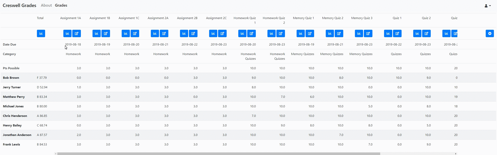
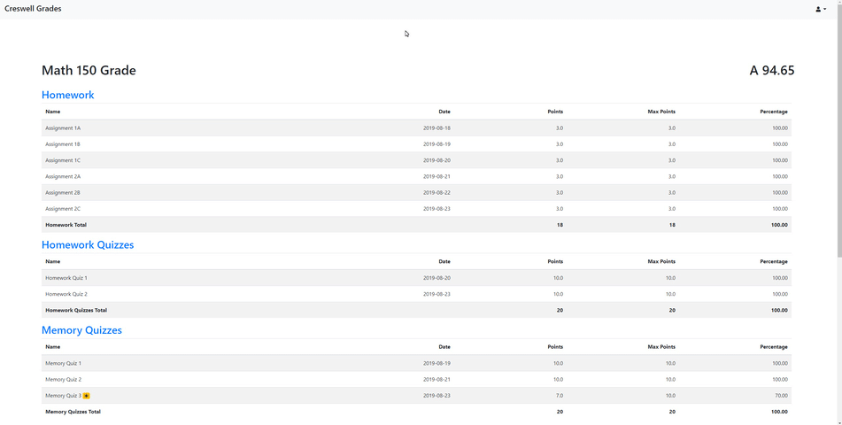

# [CreswellGrades](https://creswell-grades.herokuapp.com/)

## Features

- Teacher gradebook
  - Up to 8 grade categories
  - Lowest grade dropping
- Student grade viewer
  - Breakdown by category
  - Shows dropped grades
  - What if grades

## Install
 
### First Time Setup
1. (optional) Set up [virtualenv](https://virtualenv.pypa.io/en/latest/userguide/) ([see below](#set-up-virtualenv)) 
2. Install dependencies: `(sudo) pip install -r requirements.txt`
3. Install postgres ([see below](#install-postgres))
4. Create database ([see below](#create-postgres-database))
5. Import database structure: `python manage.py db upgrade`
5. Basic db setup: `python set_up_db.py`
6. Run app: `./develop.sh` (or [see below](#run-application))

### Set Up Virtualenv
`(sudo) pip install virtualenv`  
`virtualenv env`  
`source env/bin/activate`  

### Install Postgres  
Mac/Windows: [Link](https://www.openscg.com/bigsql/postgresql/installers.jsp/)  
Linux: Install through package manager

### Create Postgres Database
`psql -U postgres`  
`CREATE DATABASE grades`  
`CREATE DATABASE gradestest` (for testing)  

### Run Application
`export APP_SETTINGS=config.DevelopmentConfig`  
`export DATABASE_URL="postgresql://localhost/grades"`  
`export SECRET_KEY= ___` (replace with actual secret key)  
`export FLASK_APP=app.py`  
`flask run`

## Development

### Edit Models
1. Make edits in models.py.
2. (first time) `python manage.py db init`
3. (first time) `python set_up_db.py`
4. `python manage.py db migrate`
5. `python manage.py db upgrade`

### Deploy
`heroku config:set APP_SETTINGS=config.ProductionConfig --remote pro`  
`git push pro master`
